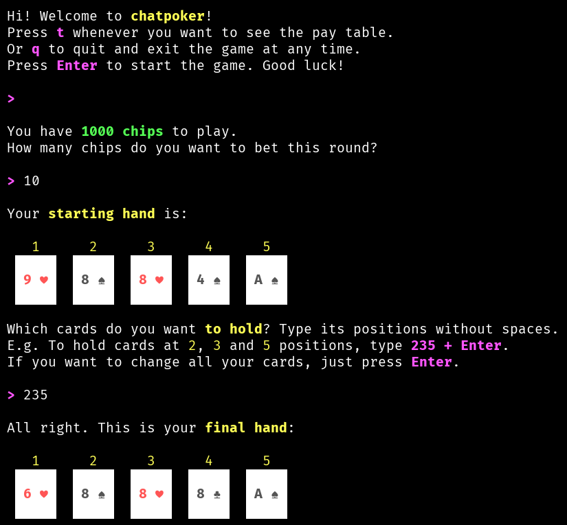

# chatpoker
A terminal-based video poker game written in Python.

## About chatpoker

The game implements the ["Jacks or Better"](https://en.wikipedia.org/wiki/Video_poker#Jacks_or_Better) video poker version and runs entirely on terminal, with some nice colors and simple graphics.



## Requirements

**chatpoker** was only tested on my machine (Linux Manjaro distro) using Python 3.10.9, but probably will work on another versions and operating systems.

A terminal compatible with ANSI escape code and UFT-8 font is necessary to render colors and suit symbols used in the cards (♣ ♥ ♠ ♦).

Since the game not uses third party libraries, you don't need any Python virtual environment neither a `requirements.txt` file. Just clone this repo, run the `poker.py` file on terminal and have fun :)

```
git clone https://github.com/zelacerda/chatpoker.git
```

```
cd chatpoker
```

```
python poker.py
```

## Docker version

There's also a [Docker version on Docker Hub](https://hub.docker.com/r/zelacerda/chatpoker/tags) that you can use without install any file or dependency. Presuming Docker is installed on your system, use the command below to pull the image and run the containerized version:

```
docker run --rm -it zelacerda/chatpoker
```

Feel free to use, modify and distribute!

**version 1.0.1 - 2023 - by zelacerda**